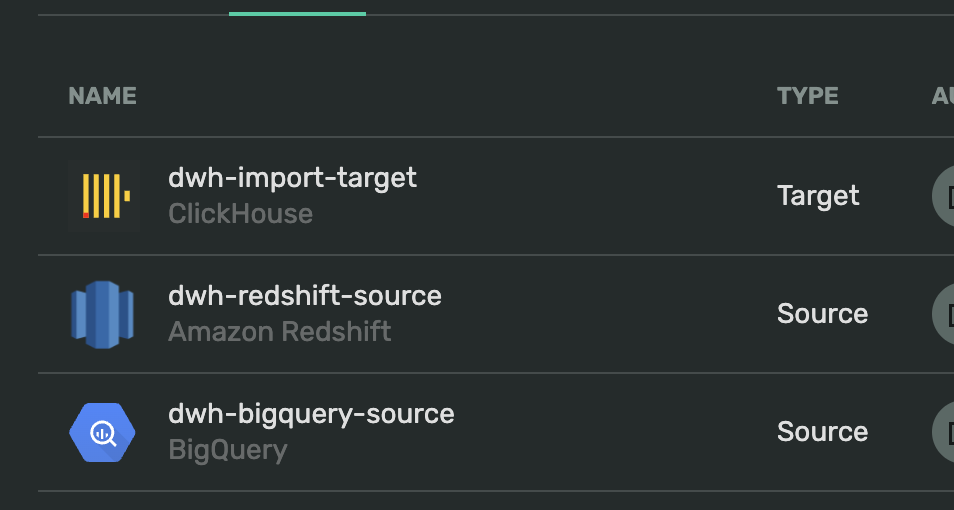
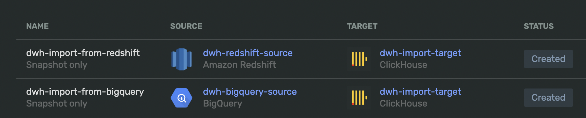
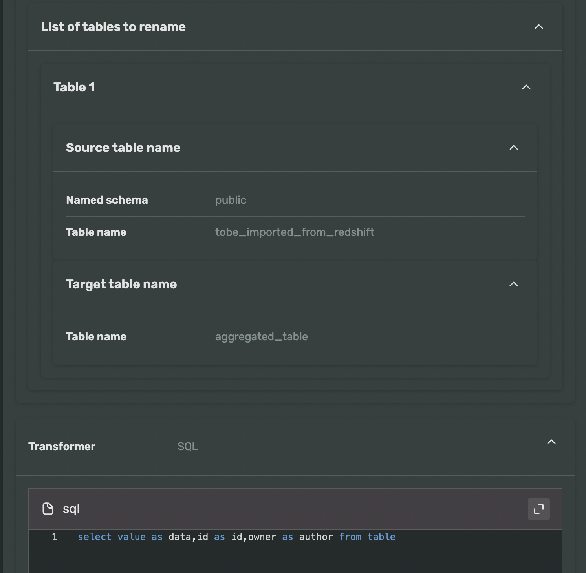

## Clickhouse DWH importer

More advanced example, take Clickhouse cluster and Import into it BigQuery, Redshift and Postgres tables.

Each table has own uniq structure and name, but in target database all land in same big table.
To make this happens for each source we create uniq transfer with 2 *transformers*

Configuration of target table:

```sql
create table on cluster '{cluster}' if not exists aggregated_table
    (
        id UInt64,
        owner String,
        value String
    ) 
    engine = ReplicatedMergeTree
    PRIMARY KEY (id) ORDER BY (id)
    SETTINGS index_granularity = 8192;
```

For each source we create an endpoint and a transfer, each transfer have 2 transformers:

1. Rename transformer, to change original source name into `customer_data`
2. SQL transformer to map source DB structure into `customer_data` structure. The data structure of each source db is known upfront, so we create SQL transform function for each of them. 

As result, you will see something like:

```shell
2024/02/12 23:52:13 Created ClickHouse destination endpoint:  dteso6lc65l99060nene
2024/02/12 23:52:13 Created source endpoint:  dteqjm00id27p3ikj2q4
2024/02/12 23:52:13 Wonderful! 🚀 Check out created transfer
        https://app.double.cloud/data-transfer/dttrlrlrlfqgjjt0qlkc
2024/02/12 23:52:13 Created source endpoint:  dtecjeb879nuh1bkotgt
2024/02/12 23:52:13 Wonderful! 🚀 Check out created transfer
        https://app.double.cloud/data-transfer/dtt22tr5un61s795rjo0
```

This is also visible in UI:

**Endpoints**



**Transfers**




**Transformers**


